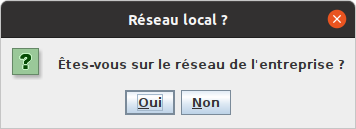
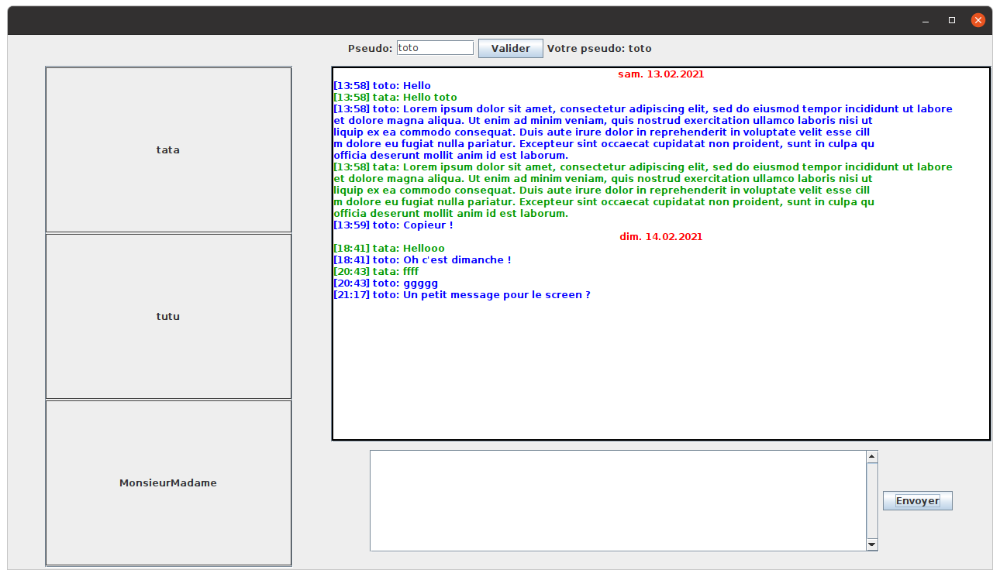

<<<<<<< HEAD
Manuel d’utilisation
====================

Installation
------------

### Configuration du serveur de présence

Le serveur de présence est nécessaire lorsque vous voulez permettre la communication entre le réseau local de l’entreprise et ceux à l’extérieur (modélisés par deux plage de ports distinctes). Vous devez donc le lancer en premier, et le laisser tourner sur une machine faisant office de relais. La configuration du serveur s’effectue directement dans *presence_server.jar*, dans le fichier *properties/config.properties*. Sous linus, il est éditable avec vi, via le terminal :

        vi presence_server.jar +16

Les différents champs de configuration :

-   listening_port_try_start : début de la plage de ports UDP/TCP d’écoute utilisables par le serveur. Défaut : 50000

-   listening_port_try_end : fin de la plage de ports UDP/TCP d’écoute utilisables par le serveur (un seul sera utilisé). Défaut : 51000

-   start_port_ext : Début de la plage de ports utilisables par les utilisateurs externes. Défaut : 64000

-   end_port_ext : Fin de la plage de ports utilisables par les utilisateurs externes. Défaut : 64500.

-   start_port_in : Début de la plage de ports utilisables par les utilisateurs internes. Défaut : 64501.

-   end_port_in : Fin de la plage de ports utilisables par les utilisateurs internes. Défaut : 65001

À la fin de la configuration, lancez le serveur de présence :

        java -jar presence_server.jar

Le port d’écoute choisi par le serveur est affiché dans le terminal [man:prport], notez le et laisser le serveur tourner tant que vous voulez permettre la communication avec la plage de port correspondant à l’extérieur de l’entreprise.

### Configuration de client

La configuration du client s’effectue directement dans *client.jar*, dans le fichier *properties/config.properties*. Sous linus, il est éditable avec vi, via le terminal :

        vi client.jar +37

Configuration de la base de donnée :

-   db.usr : Le nom d’utilisateur de la base de donnée.

-   db.pswd : Le mot de passe de l’utilisateur de la base de donnée

-   db.url : L’url de la base de donnée (jdbc)

-   db.table : Le nom de la table à utiliser. Défaut: Messages

Configuration des plages de ports (elles doivent êtres égales à celles spécifiées pour le serveur de présence):

-   pr.presence_server : Le numéro du port d’écoute utilisé par le serveur de présence (voir [man:prport]). Défaut : 50000

-   start_port_ext : Début de la plage de ports utilisables par les utilisateurs externes. Défaut : 64000

-   end_port_ext : Fin de la plage de ports utilisables par les utilisateurs externes. Défaut : 64500.

-   start_port_in : Début de la plage de ports utilisables par les utilisateurs internes. Défaut : 64501.

-   end_port_in : Fin de la plage de ports utilisables par les utilisateurs internes. Défaut : 65001

### Génération de la base de donnée

Voici la requête MySQL à effectuer pour construire la structure de la base de donnée utilisé pour l’historique des messages :

        CREATE TABLE `Messages` (
            `id` int(11) NOT NULL AUTO_INCREMENT,
            `source` int(11) NOT NULL,
            `dest` int(11) NOT NULL,
            `content` text,
            `date` datetime DEFAULT CURRENT_TIMESTAMP,
        PRIMARY KEY (`id`);
    )

### Déploiement

Une fois le serveur lancé, la base de donnée créée (si elle ne l’est pas déjà) et le client configuré, la seule chose à faire pour déployer l’application est de copier le fichier client.jar sur les machines voulant l’utiliser.

Utilisation
-----------

### Lancement de l’application

Pour lancer l’application :

        java -jar client.jar

Au lancement de l’application, un pop-up vous demande si vous êtes sur le réseau local de l’entreprise. Fermer le pop-up considère que vous y êtes.

### Choix du pseudo

Une fois l’application lancée, vous devez chosir un pseudo. Il doit être composé de 2 à 15 caractères alphanumériques. Si votre pseudo est valide et accepté par le réseau, alors il est affiché en haut de la fenêtre.

S’il est refusé, un message s’affiche aussi en haut de la fenêtre.

### Discuter avec un utilisateur

Après avoir choisi votre pseudo, la liste des utilisateurs connectés s’affiche sur la droite de la fenêtre. Pour discuter avec un utilisateur et voir les messages que vous avez échangé avec lui précédemment, il suffit de cliquer sur son pseudo. Pour lui envoyer un message, saisissez le dans la zone de texte, puis cliquez sur envoyer.

### Déconnexion

Pour vous déconnecter, il vous suffit de fermer la fenêtre de l’application.

=======
Manuel d’utilisation
====================

Installation
------------

### Configuration du serveur de présence

Le serveur de présence est nécessaire lorsque vous voulez permettre la communication entre le réseau local de l’entreprise et ceux à l’extérieur (modélisés par deux plage de ports distinctes). Vous devez donc le lancer en premier, et le laisser tourner sur une machine faisant office de relais. La configuration du serveur s’effectue directement dans *presence_server.jar*, dans le fichier *properties/config.properties*. Sous linus, il est éditable avec vi, via le terminal :

        vi presence_server.jar +16

Les différents champs de configuration :

-   listening_port_try_start : début de la plage de ports UDP/TCP d’écoute utilisables par le serveur. Défaut : 50000

-   listening_port_try_end : fin de la plage de ports UDP/TCP d’écoute utilisables par le serveur (un seul sera utilisé). Défaut : 51000

-   start_port_ext : Début de la plage de ports utilisables par les utilisateurs externes. Défaut : 64000

-   end_port_ext : Fin de la plage de ports utilisables par les utilisateurs externes. Défaut : 64500.

-   start_port_in : Début de la plage de ports utilisables par les utilisateurs internes. Défaut : 64501.

-   end_port_in : Fin de la plage de ports utilisables par les utilisateurs internes. Défaut : 65001

À la fin de la configuration, lancez le serveur de présence :

        java -jar presence_server.jar

Le port d’écoute choisi par le serveur est affiché dans le terminal [man:prport], notez le et laisser le serveur tourner tant que vous voulez permettre la communication avec la plage de port correspondant à l’extérieur de l’entreprise.

### Configuration de client

La configuration du client s’effectue directement dans *client.jar*, dans le fichier *properties/config.properties*. Sous linus, il est éditable avec vi, via le terminal :

        vi client.jar +37

Configuration de la base de donnée :

-   db.usr : Le nom d’utilisateur de la base de donnée.

-   db.pswd : Le mot de passe de l’utilisateur de la base de donnée

-   db.url : L’url de la base de donnée (jdbc)

-   db.table : Le nom de la table à utiliser. Défaut: Messages

Configuration des plages de ports (elles doivent êtres égales à celles spécifiées pour le serveur de présence):

-   pr.presence_server : Le numéro du port d’écoute utilisé par le serveur de présence (voir [man:prport]). Défaut : 50000

-   start_port_ext : Début de la plage de ports utilisables par les utilisateurs externes. Défaut : 64000

-   end_port_ext : Fin de la plage de ports utilisables par les utilisateurs externes. Défaut : 64500.

-   start_port_in : Début de la plage de ports utilisables par les utilisateurs internes. Défaut : 64501.

-   end_port_in : Fin de la plage de ports utilisables par les utilisateurs internes. Défaut : 65001

### Génération de la base de donnée

Voici la requête MySQL à effectuer pour construire la structure de la base de donnée utilisé pour l’historique des messages :

        CREATE TABLE `Messages` (
            `id` int(11) NOT NULL AUTO_INCREMENT,
            `source` int(11) NOT NULL,
            `dest` int(11) NOT NULL,
            `content` text,
            `date` datetime DEFAULT CURRENT_TIMESTAMP,
        PRIMARY KEY (`id`);
    )

### Déploiement

Une fois le serveur lancé, la base de donnée créée (si elle ne l’est pas déjà) et le client configuré, la seule chose à faire pour déployer l’application est de copier le fichier client.jar sur les machines voulant l’utiliser.

Utilisation
-----------

### Lancement de l’application

Pour lancer l’application :

        java -jar client.jar

Au lancement de l’application, un pop-up vous demande si vous êtes sur le réseau local de l’entreprise. Fermer le pop-up considère que vous y êtes.

### Choix du pseudo

Une fois l’application lancée, vous devez chosir un pseudo. Il doit être composé de 2 à 15 caractères alphanumériques. Si votre pseudo est valide et accepté par le réseau, alors il est affiché en haut de la fenêtre.

S’il est refusé, un message s’affiche aussi en haut de la fenêtre.

### Discuter avec un utilisateur

Après avoir choisi votre pseudo, la liste des utilisateurs connectés s’affiche sur la droite de la fenêtre. Pour discuter avec un utilisateur et voir les messages que vous avez échangé avec lui précédemment, il suffit de cliquer sur son pseudo. Pour lui envoyer un message, saisissez le dans la zone de texte, puis cliquez sur envoyer.

### Déconnexion

Pour vous déconnecter, il vous suffit de fermer la fenêtre de l’application.
>>>>>>> c16891d1df0ceebb978c964d7529ca1facedbbe6
